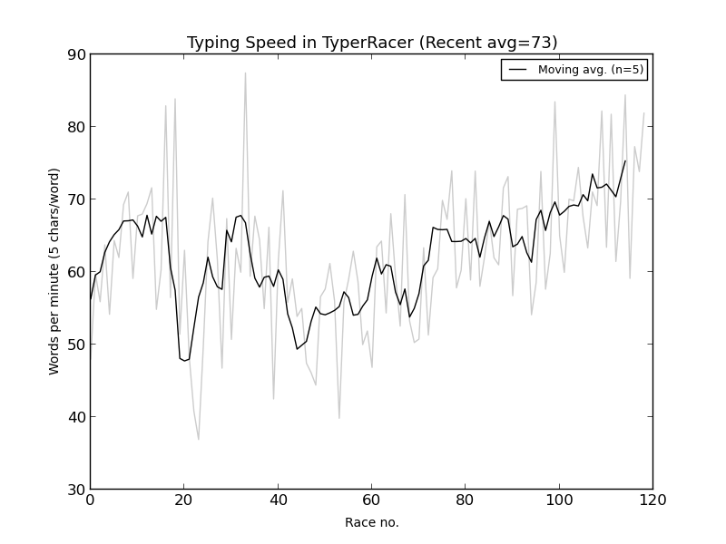

# My typing

Files related to mechanical keyboards and typing.

# Keyboard

## Keyboard, Pok3er

My [Pok3r layout](http://www.keyboard-layout-editor.com/##@_backcolor=#ffffff&name=Pok3r&author=Thomas%20B%C3%B8vith&notes=Vortex%20KBC%20Pok3r,%20black%20with%20backlight,%20red%20Cherry%20MX%20switches.&switchMount=cherry&switchBrand=cherry&switchType=MX1A-L1xx&pcb:true;&@=Esc%0A%0A%0A%0A$&=!%0A1%0A%0A%0AF1&=%22%0A2%0A%0A/@%0AF2&=#%0A3%0A%0A%C2%A3%0AF3&=%C2%A4%0A4%0A%0A$%0AF4&=%25%0A5%0A%0A%C2%BD%0AF5&=/&%0A6%0A%0A%C2%A5%0AF6&=//%0A7%0A%0A%7B%0AF7&=(%0A8%0A%0A%5B%0AF8&=)%0A9%0A%0A%5D%0AF9&=/=%0A0%0A%0A%7D%0AF10&=?%0A+%0A%0A%C2%B1%0AF11&=%60%0A%27%0A%0A%7C%0AF12&_w:2;&=Backspace;&@_w:1.5;&=Tab&=Q%0A%0A%0A%0AScrDmp&=W%0A%0A%0A%0AEnter&=E%0A%0A%0A%E2%82%AC%0AEnd&=R%0A%0A%0A%0A(%20)&=T%0A%0A%0A%0A%7B%20%7D&=Y%0A%0A%0A%0A%5B%20%5D&=U%0A%0A%0A%0APgUp&=I%0A%0A%0A%0AUp&=O%0A%0A%0A%0APgDn&=P%0A%0A%0A%0AUp&=%C3%85%0A%0A%0A%0A%7C&=%5E%0A%22%0A%0A~%0AComp&_x:0.25&w:1.25&w2:1.5&x2:-0.25;&=Enter;&@_w:1.75;&=Ctrl&=A%0A%0A%0A%0AHome&=S%0A%0A%0A%0AIns&=D%0A%0A%0A%0ADel&=F%0A%0A%0A%0ARight&=G%0A%0A%0A%0A//&=H%0A%0A%0A%0ABackSp&=J%0A%0A%0A%0ALeft&=K%0A%0A%0A%0ADown&=L%0A%0A%0A%0ARight&=%C3%86%0A%0A%0A%0ABackSp&=%C3%98%0A%0A%0A%0AVolDn&=*%0A%27%0A%0A%0AVolUp;&@_w:1.25;&=Shift&=%3E%0A%3C%0A%0A%5C&=Z%0A%0A%0A%0AMenu&=X%0A%0A%0A%0ABcklight&=C%0A%0A%0A%0A~&=V%0A%0A%0A%0A%E2%80%93&=B%0A%0A%0A%0ALeft&=N%0A%0A%0A%0ADown&=M%0A%0A%0A%0ADefault&=/;%0A,%0A%0A%0ALayer%202&=/:%0A.%0A%0A%0ALayer%203&=/_%0A-%0A%0A%0ALayer%204&_w:2.75;&=Shift;&@_w:1.25;&=FN&_w:1.25;&=Super&_w:1.25;&=Alt&_a:7&w:6.25;&=&_a:4&w:1.25;&=AltGr&_w:1.25;&=Super&_w:1.25;&=PN&_w:1.25;&=Ctrl) at [Keyboard Layout Editor](http://www.keyboard-layout-editor.com/)

# My Typeracer statistics

