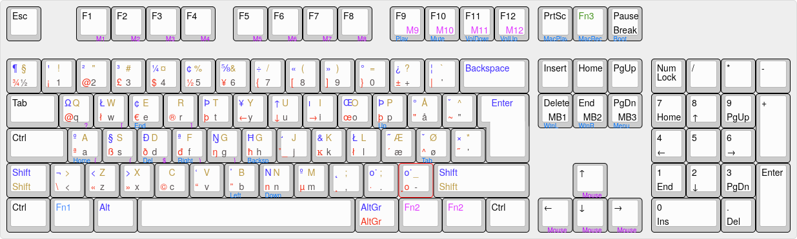

# My typing

Files related to mechanical keyboards and typing.

# Keyboard
Layouts made using [keyboard-layout-editor.com](http://www.keyboard-layout-editor.com/).

## Current keyboard: FILCO, Majestouch-2

FILCO, Majestouch-2, tenkeyless (88 keys) and fullsize (105 keys), ISO Danish layout

Replaced the controllers with The Pegasus Hoof (TKL) and Tiger Lily (Full Size) controllers from http://bathroomepiphanies.com/controllers/

# My Typeracer statistics

