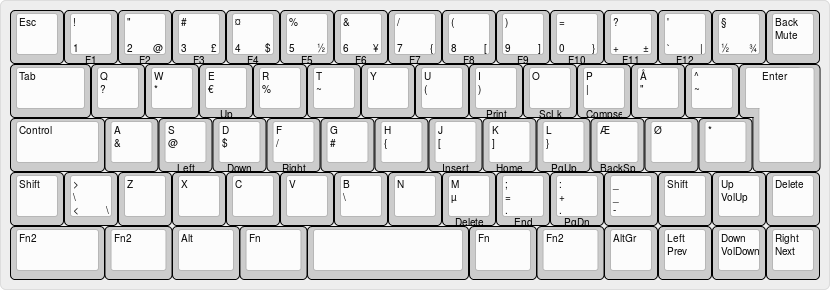

# My typing

Files related to mechanical keyboards and typing.

# Keyboard
Layouts made using [keyboard-layout-editor.com](http://www.keyboard-layout-editor.com/).

## Keyboard, FILCO MINILA

FILCO, Majestouch MINILA, 60% compact (68 keys), ISO Danish layout

# My Typeracer statistics

