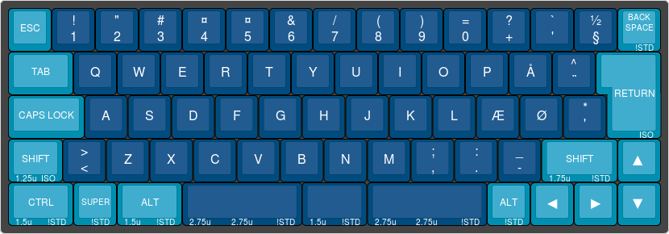
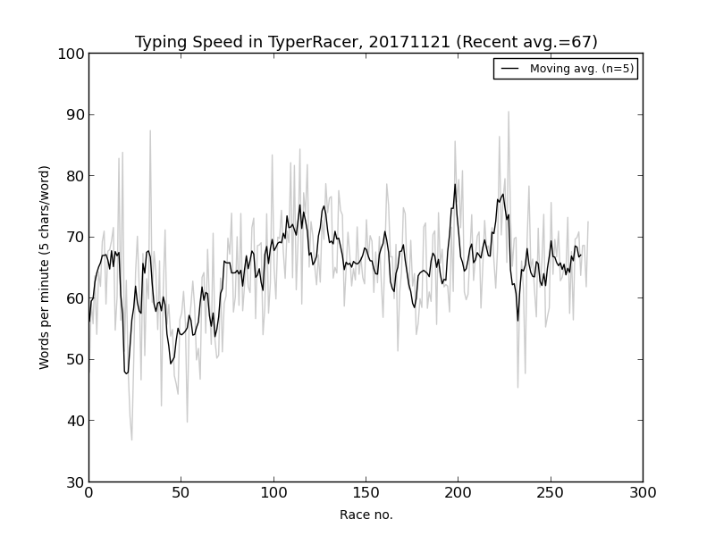

# My typing

Files related to mechanical keyboards and typing.

# Keyboard

All layouts made using [keyboard-layout-editor.com](http://www.keyboard-layout-editor.com/).

## Keyboard, Banana Split

BananaSplit, 66 key, ISO Danish layout

## Keyboard, FILCO Majestouch-2

FILCO, Majestouch-2, full size (105 keys), Cherry MX Blue switches, ISO Danish layout

## Keyboard, FILCO MINILA

FILCO, Majestouch MINILA, 60% compact (68 keys), ISO Danish layout

## Keyboard, Vortex Pok3er

Vortex Pok3r layout

# My Typeracer statistics

